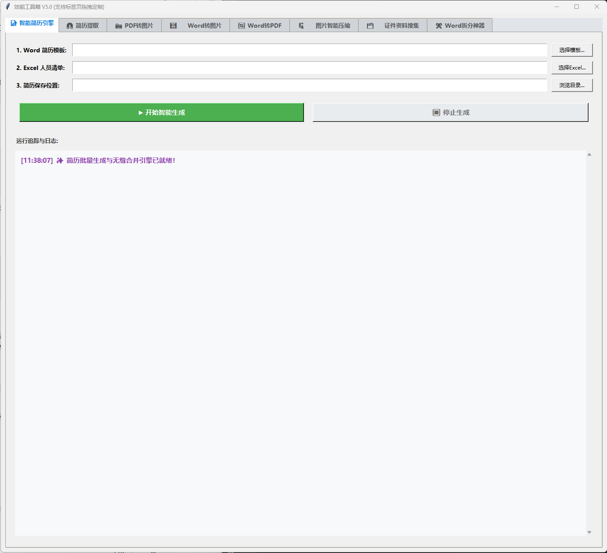

# 🧰 效能工具箱 V5.0 (Implementation Toolkit)

本项目是一个高度集成的企业级桌面效能工作台，采用 Python + Tkinter 构建。专为实施交付、人事管理及日常办公自动化设计。软件内置了防多开机制，并支持灵活的 UI 标签页拖拽定制，致力于提供稳定、开箱即用的自动化解决方案。

## ✨ 核心功能模块

工具箱目前集成了 8 大核心效能引擎：

1. **📝 智能简历引擎**：结构化数据与简历模板的自动化融合与生成。
2. **🧲 简历提取**：基于 Excel 数据驱动的逆向简历信息提取神器。
3. **🗂️ 证件资料搜集**：智能文件分发与搜集系统。
4. **🖼️ Word 转图片**：高质量、批量的 Word 文档图像化转换。
5. **📸 PDF 转图片**：底层基于 `PyMuPDF` 的高速 PDF 栅格化工具。
6. **🗜️ 图片智能压缩**：在保证画质的前提下，对图像文件进行体积优化。
7. **🔄 Word 转 PDF**：调用原生 Office 接口，实现文档格式的无损转换。
8. **✂️ Word 拆分神器**：根据文档大纲，自动化拆分大型 Word 文档。

## 🌟 亮点特性

* **交互式 UI 定制**：支持鼠标长按拖拽标签页进行自由排序，关闭软件后会自动记忆当前布局（持久化保存至 `app_layout_config.json`）。
* **文件拖拽支持**：全面接入 `tkinterdnd2`，支持将文件直接拖拽至软件界面进行处理。
* **系统级防多开**：通过 Windows 系统级互斥锁（Mutex）防止程序重复启动，保障数据与内存安全。

## 🛠️ 环境依赖与要求

* **操作系统**：Windows (强依赖 `pywin32` 实现底层控制)
* **Python 版本**：Python 3.8+ (建议使用独立虚拟环境)
* **核心依赖库**：`PyMuPDF`, `pandas`, `openpyxl`, `Pillow`, `python-docx`, `docxtpl` 等

## 🚀 快速部署指南

为保证项目在严控的企业级内网服务器或个人电脑中稳定运行，请务必使用独立的虚拟环境进行部署：

### 1. 克隆项目
```bash
git clone https://github.com/xinergya/implementation_toolkit.git(https://github.com/xinergya/implementation_toolkit.git)
cd implementation_toolkit
```

### 2. 创建并激活独立的虚拟环境
```bash
# 创建名为 venv 的虚拟环境
python -m venv venv

# 激活虚拟环境 (Windows)
venv\Scripts\activate
```

### 3. 一键安装依赖
本项目已提供精确版本锁定的依赖清单，确保 100% 复现开发环境：
```bash
pip install -r requirements.txt
```

### 4. 运行程序
依赖安装完成后，即可启动主程序：
```bash
python main_toolbox.py
```

## 📂 项目结构说明

* `main_toolbox.py`：项目主入口、全局 UI 框架及防多开逻辑所在文件。
* `tools/`：核心功能模块目录，包含了各个独立工具的引擎逻辑（如 `word2img_engine.py` 等）。
* `utils/`：通用工具函数与格式化组件存放目录。
* `requirements.txt`：项目运行所需的精准依赖清单。
* `.gitignore`：Git 提交拦截规则，保持代码仓库的纯净。

## 📸 界面预览 (Screenshots)
### 主界面

### 智能简历生成日志


## 🤝 贡献与维护
如需开发新功能或修复 Bug，请在本地创建新的分支（Branch）进行开发，测试通过后再合并到 `main` 主分支。